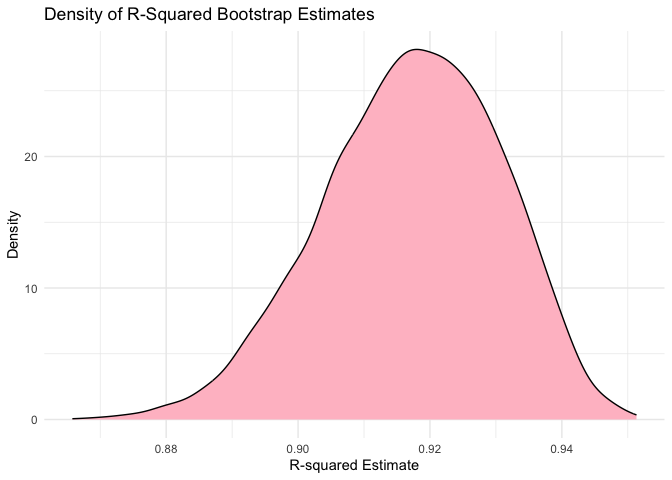
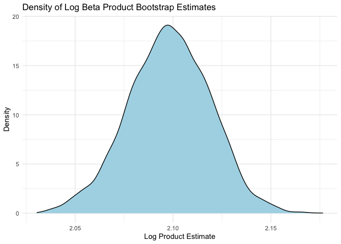

Data Science I HW 6
================
Hingling Yu
2023-11-29

## Problem 2

### Fetching and preparing weather data

``` r
weather_df = 
  rnoaa::meteo_pull_monitors(
    c("USW00094728"),
    var = c("PRCP", "TMIN", "TMAX"), 
    date_min = "2022-01-01",
    date_max = "2022-12-31") |>
  mutate(
    name = recode(id, USW00094728 = "CentralPark_NY"),
    tmin = tmin / 10,
    tmax = tmax / 10) |>
  select(name, id, everything())
```

    ## using cached file: /Users/angelyu/Library/Caches/org.R-project.R/R/rnoaa/noaa_ghcnd/USW00094728.dly

    ## date created (size, mb): 2023-10-05 22:48:04.670997 (8.534)

    ## file min/max dates: 1869-01-01 / 2023-10-31

### Create bootstrap function

``` r
set.seed(2)
sample_bootstrap = 
  function(data_frame) {
    data_frame %>% sample_frac(replace = TRUE)
  }
```

### Create 5000 bootstrap samples

``` r
bootstrap_data = 
  weather_df %>%  
  modelr::bootstrap(n = 5000) %>% 
  mutate(
    lm_models = map(strap, ~lm(tmax ~ tmin + prcp, data = .)),
    beta_glance = map(lm_models, broom::glance),
    beta_tidy = map(lm_models, broom::tidy)) %>% 
  unnest(beta_glance, beta_tidy) %>% 
  select(.id, term, estimate, r.squared) %>% 
  pivot_wider(
    names_from = term, 
    values_from = estimate
  ) %>% 
  rename(
    beta_0 = `(Intercept)`,
    beta_1 = tmin,
    beta_2 = prcp
  )
```

### Confidence interval for $\hat{r}^2$

``` r
r_squared_ci = 
  bootstrap_data %>%
  select(r.squared) %>%
  summarize(
    ci_lower = quantile(r.squared, 0.025),
    ci_upper = quantile(r.squared, 0.975)
  )

r_squared_ci
```

    ## # A tibble: 1 × 2
    ##   ci_lower ci_upper
    ##      <dbl>    <dbl>
    ## 1    0.889    0.941

### Plotting distribution of $\hat{r}^2$

``` r
bootstrap_data %>%
  select(r.squared) %>%
  ggplot(aes(x = r.squared)) + 
  geom_density(fill = "pink", color = "black") + 
  labs(
    title = "Density of R-Squared Bootstrap Estimates",
    x = "R-squared Estimate",
    y = "Density"
  )
```

<!-- -->
\### Plot Description $\hat{r}^2$

- The distribution appears to be skewed left, indicating that most of
  the bootstrap samples resulted in $R^2$ values closer to the higher
  end of the scale, with fewer samples showing lower $R^2$. The peak of
  the density is around 0.92, suggesting that the linear model explains
  a substantial portion of the variance in the maximum temperature based
  on the minimum temperature, on most occasions.

### Confidence interval for $\log(\hat{\beta}_0 \ast \hat{\beta}_1)$

``` r
bootstrap_log_values = 
  bootstrap_data %>% 
  mutate(
    log_beta_product = log(beta_0 * beta_1)
  )

# Confidence interval log_beta
log_beta_ci = 
  bootstrap_log_values %>%
  select(log_beta_product) %>% 
  summarize(
    ci_lower = quantile(log_beta_product, 0.025),
    ci_upper = quantile(log_beta_product, 0.975)
  )

log_beta_ci
```

    ## # A tibble: 1 × 2
    ##   ci_lower ci_upper
    ##      <dbl>    <dbl>
    ## 1     2.06     2.14

### Plot distribution for $\log(\hat{\beta}_1 \ast \hat{\beta}_2)$

``` r
bootstrap_log_values %>%
  select(log_beta_product) %>%
  ggplot(aes(x = log_beta_product)) + 
  geom_density(fill = "lightblue", color = "black") + 
  labs(
    title = "Density of Log Beta Product Bootstrap Estimates",
    x = "Log Product Estimate",
    y = "Density"
  )
```

<!-- -->

### Plot Description

- This plot displays the density of the logarithm of the product of two
  regression coefficients,$\beta_{tmin}$ and $\beta_{prcp}$. This
  distribution seems fairly symmetrical and bell-shaped, centering
  around 2.10, indicating that the log-transformed product of the
  coefficients varies less and is more consistent across bootstrap
  samples compared to the $R^2$ values.

## Problem 3

### Load/tidy the `birthweight.csv` and convert factors

``` r
birthweight_data =
  read_csv("data/birthweight.csv") %>% 
  janitor::clean_names() %>% 
  mutate(
    babysex = factor(babysex, levels = c(1, 2), labels = c("Male", "Female")),
    frace = factor(frace, levels = c(1, 2, 3, 4, 8, 9), labels = c("White", "Black", "Asian", "Puerto Rican", "Other", "Unknown")),
    mrace = factor(mrace, levels = c(1, 2, 3, 4, 8), labels = c("White", "Black", "Asian", "Puerto Rican", "Other")),
    malform = factor(malform, levels = c(0, 1), labels = c("Absent", "Present"))
  )
```

    ## Rows: 4342 Columns: 20
    ## ── Column specification ────────────────────────────────────────────────────────
    ## Delimiter: ","
    ## dbl (20): babysex, bhead, blength, bwt, delwt, fincome, frace, gaweeks, malf...
    ## 
    ## ℹ Use `spec()` to retrieve the full column specification for this data.
    ## ℹ Specify the column types or set `show_col_types = FALSE` to quiet this message.

``` r
# Check for missing datas

skimr::skim(birthweight_data)
```

|                                                  |                  |
|:-------------------------------------------------|:-----------------|
| Name                                             | birthweight_data |
| Number of rows                                   | 4342             |
| Number of columns                                | 20               |
| \_\_\_\_\_\_\_\_\_\_\_\_\_\_\_\_\_\_\_\_\_\_\_   |                  |
| Column type frequency:                           |                  |
| factor                                           | 4                |
| numeric                                          | 16               |
| \_\_\_\_\_\_\_\_\_\_\_\_\_\_\_\_\_\_\_\_\_\_\_\_ |                  |
| Group variables                                  | None             |

Data summary

**Variable type: factor**

| skim_variable | n_missing | complete_rate | ordered | n_unique | top_counts                              |
|:--------------|----------:|--------------:|:--------|---------:|:----------------------------------------|
| babysex       |         0 |             1 | FALSE   |        2 | Mal: 2230, Fem: 2112                    |
| frace         |         0 |             1 | FALSE   |        5 | Whi: 2123, Bla: 1911, Pue: 248, Asi: 46 |
| malform       |         0 |             1 | FALSE   |        2 | Abs: 4327, Pre: 15                      |
| mrace         |         0 |             1 | FALSE   |        4 | Whi: 2147, Bla: 1909, Pue: 243, Asi: 43 |

**Variable type: numeric**

| skim_variable | n_missing | complete_rate |    mean |     sd |     p0 |     p25 |     p50 |     p75 |   p100 | hist  |
|:--------------|----------:|--------------:|--------:|-------:|-------:|--------:|--------:|--------:|-------:|:------|
| bhead         |         0 |             1 |   33.65 |   1.62 |  21.00 |   33.00 |   34.00 |   35.00 |   41.0 | ▁▁▆▇▁ |
| blength       |         0 |             1 |   49.75 |   2.72 |  20.00 |   48.00 |   50.00 |   51.00 |   63.0 | ▁▁▁▇▁ |
| bwt           |         0 |             1 | 3114.40 | 512.15 | 595.00 | 2807.00 | 3132.50 | 3459.00 | 4791.0 | ▁▁▇▇▁ |
| delwt         |         0 |             1 |  145.57 |  22.21 |  86.00 |  131.00 |  143.00 |  157.00 |  334.0 | ▅▇▁▁▁ |
| fincome       |         0 |             1 |   44.11 |  25.98 |   0.00 |   25.00 |   35.00 |   65.00 |   96.0 | ▃▇▅▂▃ |
| gaweeks       |         0 |             1 |   39.43 |   3.15 |  17.70 |   38.30 |   39.90 |   41.10 |   51.3 | ▁▁▂▇▁ |
| menarche      |         0 |             1 |   12.51 |   1.48 |   0.00 |   12.00 |   12.00 |   13.00 |   19.0 | ▁▁▂▇▁ |
| mheight       |         0 |             1 |   63.49 |   2.66 |  48.00 |   62.00 |   63.00 |   65.00 |   77.0 | ▁▁▇▂▁ |
| momage        |         0 |             1 |   20.30 |   3.88 |  12.00 |   18.00 |   20.00 |   22.00 |   44.0 | ▅▇▂▁▁ |
| parity        |         0 |             1 |    0.00 |   0.10 |   0.00 |    0.00 |    0.00 |    0.00 |    6.0 | ▇▁▁▁▁ |
| pnumlbw       |         0 |             1 |    0.00 |   0.00 |   0.00 |    0.00 |    0.00 |    0.00 |    0.0 | ▁▁▇▁▁ |
| pnumsga       |         0 |             1 |    0.00 |   0.00 |   0.00 |    0.00 |    0.00 |    0.00 |    0.0 | ▁▁▇▁▁ |
| ppbmi         |         0 |             1 |   21.57 |   3.18 |  13.07 |   19.53 |   21.03 |   22.91 |   46.1 | ▃▇▁▁▁ |
| ppwt          |         0 |             1 |  123.49 |  20.16 |  70.00 |  110.00 |  120.00 |  134.00 |  287.0 | ▅▇▁▁▁ |
| smoken        |         0 |             1 |    4.15 |   7.41 |   0.00 |    0.00 |    0.00 |    5.00 |   60.0 | ▇▁▁▁▁ |
| wtgain        |         0 |             1 |   22.08 |  10.94 | -46.00 |   15.00 |   22.00 |   28.00 |   89.0 | ▁▁▇▁▁ |

- According to the `skim()` summary statistics, there’s no missing data.

### Regression Models for `birthweight_data`

``` r
model1 <- lm(bwt ~ gaweeks + ppbmi + momage + smoken + wtgain, data = birthweight_data)
summary(model1)
```

    ## 
    ## Call:
    ## lm(formula = bwt ~ gaweeks + ppbmi + momage + smoken + wtgain, 
    ##     data = birthweight_data)
    ## 
    ## Residuals:
    ##      Min       1Q   Median       3Q      Max 
    ## -1814.08  -283.75     0.58   288.53  1504.83 
    ## 
    ## Coefficients:
    ##             Estimate Std. Error t value Pr(>|t|)    
    ## (Intercept) -83.9073    98.7366  -0.850    0.395    
    ## gaweeks      59.8013     2.1968  27.222  < 2e-16 ***
    ## ppbmi        15.9716     2.1539   7.415 1.45e-13 ***
    ## momage       14.8910     1.7816   8.358  < 2e-16 ***
    ## smoken       -7.1924     0.9201  -7.817 6.73e-15 ***
    ## wtgain       10.1259     0.6350  15.947  < 2e-16 ***
    ## ---
    ## Signif. codes:  0 '***' 0.001 '**' 0.01 '*' 0.05 '.' 0.1 ' ' 1
    ## 
    ## Residual standard error: 447.4 on 4336 degrees of freedom
    ## Multiple R-squared:  0.2378, Adjusted R-squared:  0.2369 
    ## F-statistic: 270.6 on 5 and 4336 DF,  p-value: < 2.2e-16
